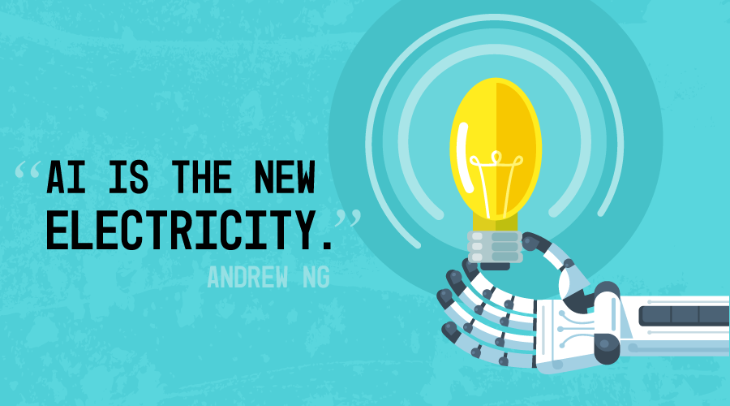

# Resources on machine learning and deep learning 

*This list will be updated. *

#### Types of tutorials:

:tv: Videos

:orange_book: Books

:page_facing_up: Documents and blog posts

## Step #1: Introduction to Machine Learning

#### :orange_book: [Oliver Theobald : Machine leanring for absolute beginners](https://www.amazon.com/Machine-Learning-Absolute-Beginners-Introduction-ebook/dp/B06VXKBLNG)

This 200 page long book gives you a general idea about machine learning and different types of algorithms used in statistical learning. It is not a must, but not bad to have a look at.

#### :tv: [Andrew Ng : machine learning course](https://www.coursera.org/learn/machine-learning)
This course starts from the basics of ML and then enters deep learning with explaining the neural networks and finally it goes to unsupervised learning methods. Also this course includes some tips and tricks for making the ML systems. It is definitely a must! Anyone who wants to start the ML should begin with this course.

#### :tv: [IBM : applied machine learning with python](https://www.coursera.org/learn/machine-learning)
This course is relatively short. It teaches how to use libraries like numpy and sci-kit learn for implementing ML algorithms. It is a good start for learning how to code ML algorithms in python.

## Step #3: Introduction to Deep Learning

#### :tv: [Deeplearning.ai : Deep learning specialization](https://www.coursera.org/specializations/deep-learning)
This specialization consists of 5 courses each about 4 weeks. The first course is an introduction to Neural networks, second is about technical details of neural networks and how to make them work better, third course is about managing ML projects and how to find errors in your work, fourth course includes convolutional neural networks and concepts of computer vision with deep learning, and final course is about natural language processing with deep learning. This is specialization is probably the best video tutorial on the internet. Along with the theory, you also learn how to TensorFlow library for implementing the deep learning algorithms. 

#### :tv: [Stanford CS213N: Convolutional Neural Networks for Visual Recognition](https://www.youtube.com/watch?v=vT1JzLTH4G4&list=PL3FW7Lu3i5JvHM8ljYj-zLfQRF3EO8sYv)
This is a recording of Stanford's CS231n class. Itcan be used as a compelementory course with course 4 of Deeplearning.ai. You can watch this course to learn about some concepts like Generaive Adversarial Networks that are not covered in Deeplearning.ai course.

#### :tv: [Stanford CS224N: NLP with Deep Learning ](https://www.youtube.com/watch?v=8rXD5-xhemo)
This is a recording of Stanford's CS224n class. this course can be used as a complementary course with course 5 of Deeplearning.ai. You can watch this course to learn about some concepts like Transformer networks that is not covered in Deeplearning.ai course.

#### :tv: [Stanford CS234: Reinforcement Learning](https://www.youtube.com/watch?v=FgzM3zpZ55o)
This is a recording of Stanford's CS234 class. It is a great introduction to reinforcement learning, which is not covered at all in Deeplearning.ai specialization.

#### :tv: [fast ai : deep learning for coders](https://course.fast.ai/)
This course is mostly practical. The tutors do not focus on theory and math involved in DL. By watching this course you can learn about PyTorch library and an easy to use API library which is called FastAi library and it is based on PyTorch. The tutors teach some useful tips and tricks about training the neural networks.

#### :tv: [deeplearning.ai : TensorFlow Specialization](https://www.coursera.org/collections/tensorflow-deeplearning-ai)
It is a relatively simple course. It focuses on implementing fundamental concepts of deep learning with Keras which is library based on TensorFlow. There isn't much theory in this specialization and it is mostly about implementing algorithms with Keras.

#### :orange_book:[online DL book-deeplearningbook](http://www.deeplearningbook.org/)
This a comprehensive book on deep learning, which starts with a quick review on the math that you need for deep learning. I don't suggest starting with this book, but after you went through some of the courses that I mentioned above, you start studying this book. The concepts are explained at depth in this book.

#### :tv: [Mathematics for Machine Learning Specialization](https://www.coursera.org/specializations/mathematics-machine-learning)
This specialization starts with Linear Algebra and goes toward some statistics and calculus. It starts from the foundations and it is not that hard to follow. It gives a good introduction to the math that is behind the ML and DL algorithms. It is a good idea to watch this course after watching the deeplearning.ai specialization.
